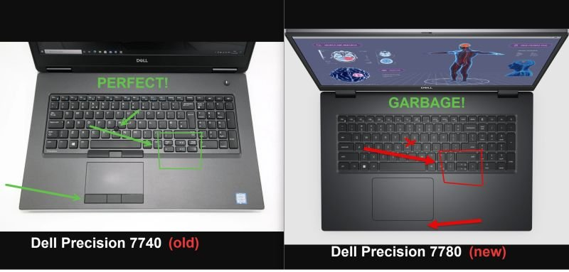

These are sad times for anyone doing serious work (coding/writing/translating) on a laptop.

Why do companies keep removing everything to make everything sleeker and more minimalistic, when it makes the computer less ergonomic?

I spend an inordinate amount of time translating on my laptop, and I need:

<ul>
<li>a touchpad with <strong>buttons under it</strong></li>
<li>properly sized up/down keys in a T-shaped navigation cluster (preferably separated from the rest of the keys, not squished in between them)</li>
</ul>

Why can’t they keep at least one model for us professionals?

I’m currently stuck on my old-ish Dell Precision 7740 because all Dell’s newer, so-called “workstation” models now have crappy keyboards with messed-up arrow keys and no buttons below the touchpad.

I’ve used Dell workstations for around 15 years, but the 7740 will be my last Dell. It looks like I’m going to have to get a ThinkPad since Lenovo is one of the few companies left that still offers semi-decent keyboards.

I literally have £3,000 to spend on a work laptop, and Dell no longer offers a single professional model.

<h2>References</h2>
<ul>
<li>https://techywithyou.com/laptop-with-mouse-buttons/</li>
<li>https://www.shopvenom.com/blackbook-pro-17/</li>
<li>https://www.metabox.com.au/store/Professional-Mobile-Workstations</li>
<li>https://www.quora.com/Why-have-laptop-designers-moved-away-from-touchpad-buttons</li>
</ul>

Source: https://michaelbeijer.co.uk/Why_do_laptop_manufacturers_no_longer_sell_models_with_actual_buttons_under_the_touchpad%3F

